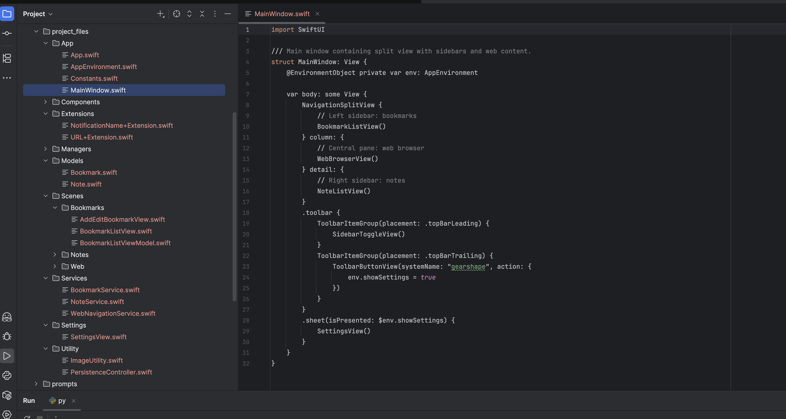
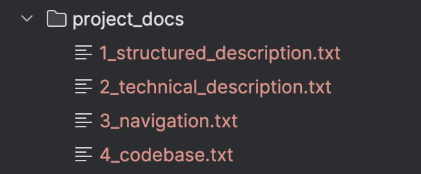
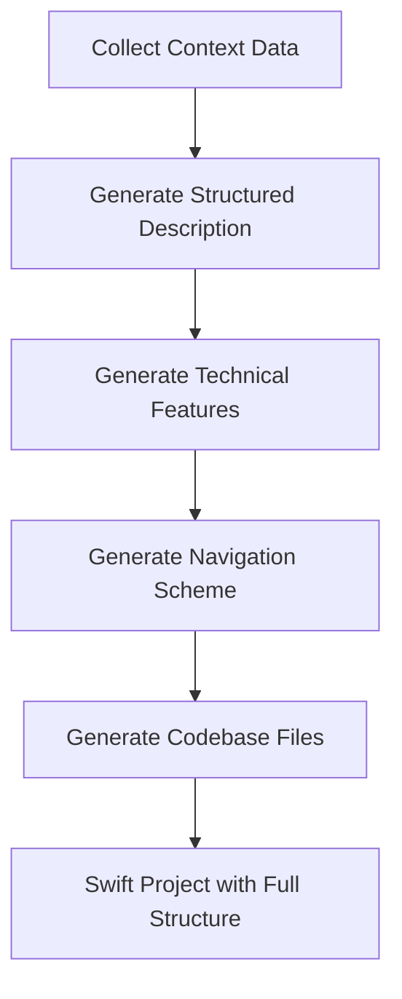

# AI Agent for Swift Project Generation

This repository contains an **AI-powered agent** that generates complete Swift projects for **macOS** or **iOS** using **SwiftUI**.  
The agent leverages LLMs with a **ReAct approach** (reasoning + action) to create real files and folders, guided by user rules, prompts, and contextual data.

---

## 🚀 Features

- **Automated Swift Project Generation**  
  - Creates a structured SwiftUI codebase with App, Scenes, Models, Services, Managers, Components, and Settings.  
  - Produces boilerplate code for navigation, persistence, and common utilities.  
  - Adapts to macOS/iOS targets.

- **Context Injection**  
  - `context.txt`: custom context data added to all chains. 

- **Rule-based Context Injection**  
  - `basic_rules_str.txt`: global generation guidelines.  
  - `user_rules_str.txt`: user-provided custom rules.  
  - `swiftui_deprecated_str.txt`: list of deprecated SwiftUI APIs from Apple docs.

- **Multi-step Prompt Pipeline**  
  - Structured project description.  
  - Technical specification.  
  - Navigation definition.  
  - Code generation with full folder and file creation.

- **Intermediate Documentation**  
  - Generated text documents (`project_docs/`) at each step of reasoning:  
    - `1_structured_description.txt`  
    - `2_technical_description.txt`  
    - `3_navigation.txt`  
    - `4_codebase.txt`

- **Testing Utilities**  
  - Token length checker for prompt safety.  
  - SwiftUI deprecation crawler and fixer scripts.  
  - Context data generators for reproducible runs.

---

## 🛠️ Project Structure

### Python Agent

```
ai_agent_swift/
├── agent.py                # Main pipeline: context → agent input → executor
├── config.py               # Configuration settings
├── schemas.py              # Pydantic schemas for Swift project representation
├── tools_utility.py        # File/folder creation tools for LLM actions
├── utility.py              # General utilities
├── check_tokens_len.py     # Token length inspection utility
├── test_context_data.py    # Testing for context data generation
└── tests/                  # Helpers: scrapers, fixers, datasets
```

### Context and Prompts

```
context_data/
├── basic_rules_str.txt
├── user_rules_str.txt
├── swiftui_deprecated_str.txt
├── *.json (structured context)
```

```
prompts/
├── 1-level-structured-description.txt
├── 2-level-technical-features.txt
├── 3-level-navigation.txt
├── 4-level-code-generation.txt
└── system_prompt.txt
```

### Generated Project

The agent produces code inside `project_files/`.  
Example result (from console output):

```
App
├── App.swift
├── MainWindow.swift
├── AppEnvironment.swift
└── Constants.swift

Components
├── ToolbarButtonView.swift
├── SidebarToggleView.swift
├── BookmarkRowView.swift
└── NoteRowView.swift

Extensions
├── URL+Extension.swift
└── NotificationName+Extension.swift

Utility
├── ImageUtility.swift
└── PersistenceController.swift

Models
├── Bookmark.swift
└── Note.swift

Services
├── BookmarkService.swift
├── NoteService.swift
└── WebNavigationService.swift

Managers
└── SyncManager.swift

Scenes
├── Bookmarks
│   ├── BookmarkListView.swift
│   ├── BookmarkListViewModel.swift
│   └── AddEditBookmarkView.swift
├── Web
│   ├── WebBrowserView.swift
│   └── WebViewModel.swift
└── Notes
    ├── NoteListView.swift
    ├── NoteListViewModel.swift
    └── AddEditNoteView.swift

Settings
└── SettingsView.swift
```

---

## 📸 Screenshots

### Generated Project (Xcode View)


### Intermediate Documentation


---

## 🔄 Pipeline Workflow



- **agent.py** ties everything together:  
  ```python
  pipeline = chain_create_context_data | to_agent_input | agent_executor
  ```
- The agent uses **prompts + context data + tools** to create Swift code.  
- Output is a **ready-to-run Swift project**.

---

## 📦 Installation & Usage

1. Clone the repo:
   ```bash
   git clone https://github.com/genry86/ai_agent_swift_generator.git
   cd ai_agent_swift_generator
   ```

2. Install dependencies:
   ```bash
   pip install -r requirements.txt
   ```

3. Configure `.env` for your LLM provider (e.g., OpenAI API key).

4. Run the agent:
   ```bash
   python agent.py
   ```

5. The generated Swift project will appear in:
   ```
   project_files/
   ```

---

## ✅ Example

Console output after a successful run:

```
================================== Ai Message ==================================

All folders and files from the provided JSON schema have been created with their respective Swift code.

**Project structure**

(App, Components, Extensions, Utility, Models, Services, Managers, Scenes, Settings …)

```

---

## 📖 Notes

- You can **edit `user_rules_str.txt`** before running the agent to customize code style, architecture, or naming conventions.  
- Deprecated SwiftUI APIs are automatically detected using `swiftui_deprecated_str.txt`.  
- The system is modular: you can swap prompts or add new chains.

---


## ⚠️ Critical Setup

Before running the agent, make sure you configure the **user rules**:

- `context_data/user_rules.json`  
- `context_data/user_rules_str.txt`  

These files **must be provided by the developer**.  
They define how the agent generates code (style, architecture rules, naming conventions, project-specific preferences).  

👉 If you don’t want to customize them yet, you can create empty files with these names — but they must exist in the `context_data/` folder, otherwise the pipeline will fail at startup.

 
## 📜 License
All rights reserved. See [LICENSE](LICENSE) for details.
